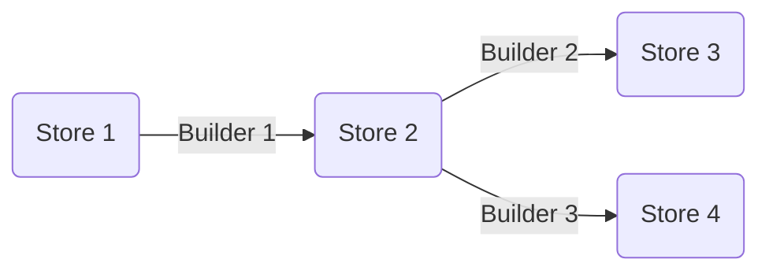

# Concepts

`maggma`'s core classes -- [`Store`](#store) and [`Builder`](#builder) -- provide building blocks for
modular data pipelines. Data resides in one or more `Store` and is processed by a
`Builder`. The results of the processing are saved in another `Store`, and so on:

## Store

A major challenge in building scalable data piplines is dealing with all the different types of data sources out there. Maggma's `Store` class provides a consistent, unified interface for querying data from arbitrary data
sources. It was originally built around MongoDB, so it's interface closely resembles `PyMongo` syntax. However,
Maggma makes it possible to use that same syntax to query other types of databases, such as Amazon S3, GridFS, or even files on disk.

Stores are databases containing organized document-based data. They represent either a data source or a data sink. They are modeled around the MongoDB collection although they can represent more complex data sources that auto-alias keys without the user knowing, or even providing concatenation or joining of Stores. Stores implement methods to `connect`, `query`, find `distinct` values, `groupby` fields, `update` documents, and `remove` documents. Stores also implement a number of critical fields for Maggma that help in efficient document processing: the `key` and the `last_updated_field`. `key` is the field that is used to uniquely index the underlying data source. `last_updated_field` is the timestamp of when that document was last modified.

## Builder

Builders represent a data processing step, analogous to an extrac-transform-load (ETL) operation in a data
warehouse model. Much like `Store`, the `Builder` class provides a consistent interface for writing data
transformations, which are each broken into 3 phases: `get_items`, `process_item`, and `update_targets`:

1. `get_items`: Retrieve items from the source Store(s) for processing by the next phase
2. `process_item`: Manipulate the input item and create an output document that is sent to the next phase for storage.
3. `update_target`: Add the processed item to the target Store(s).

Both `get_items` and `update_targets` can perform IO (input/output) to the data stores. `process_item` is expected to not perform any IO so that it can be parallelized by Maggma. Builders can be chained together into an array and then saved as a JSON file to be run on a production system.

## MSONable

Another challenge in building complex data-transformation codes is keeping track of all the settings necessary to make some output database. One bad solution is to hard-code these settings, but then any modification is difficult to keep track of.

Maggma solves this by putting the configuration with the pipeline definition in JSON or YAML files. This is done using the `MSONable` pattern, which requires that any Maggma object (the databases and transformation steps) can convert itself to a python dictionary with it's configuration parameters in a process called serialization. These dictionaries can then be converted back to the origianl Maggma object without having to know what class it belonged. `MSONable` does this by injecting in `@class` and `@module` keys that tell it where to find the original python code for that Maggma object.
