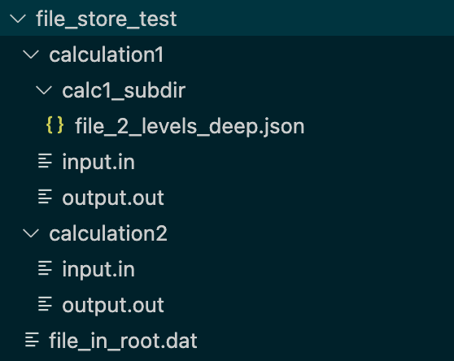

# Using `FileStore` for files on disk

The first step in any `maggma` pipeline is creating a `Store` so that data can be queried
and transformed. Often times your data will originate as files on disk (e.g., calculation output
files, files generated by instruments, etc.). `FileStore` provides a convenient way
to access this type of data as if it were in a database, making it possible to `query`, add metadata,
and run `Builder` on it.

Suppose you have some data files organized in the following directory structure:

{ width="300" }

## Creating the `FileStore`

To create a `Filestore`, simply pass the path to the top-level directory that contains the files.

```python
>>> fs = FileStore('/path/to/file_store_test/')
>>> fs.connect()
```

On `connect()`, `FileStore` iterates through all files in the base directory and
all subdirectories. For each file, it creates dict-like record based on the file's metadata such as name, size, last modification date, etc. These records are kept in
memory using an internal `MemoryStore`. An example record is shown below.

```python
{'_id': ObjectId('625e581113cef6275a992abe'),
 'name': 'input.in',
 'path': '/test_files/file_store_test/calculation1/input.in',
 'parent': 'calculation1',
 'size': 90,
 'file_id': '2d12e9803fa0c6eaffb065c8dc3cf4fe',
 'last_updated': datetime.datetime(2022, 4, 19, 5, 23, 54, 109000),
 'hash': 'd42c9ff24dc2fde99ed831ec767bd3fb',
 'orphan': False,
 'contents': 'This is the file named input.in\nIn directory calculation1\nin the FileStore test directory.'}
```

### Choosing files to index

To restrict which files are indexed by the Store (which can improve performance), the optional keyword arguments `max_depth` and `file_filters` can be used. For example, to index only files ending in ".in", use

```python
>>> fs = FileStore('/path/to/my/data', file_filters=["*.in"])
```

You can pass multiple `file_filters` and use regex-like [fnmatch](https://docs.python.org/3/library/fnmatch.html) patterns as well. For example, to index all files ending in ".in" or named "test-X.txt" where X is any single letter between a and d, use

```python
>>> fs = FileStore('/path/to/my/data', file_filters=["*.in","test-[abcd].txt"])
```

If you only want to index the root directory and exclude all subdirectories, use `max_depth=0`, e.g.

```python
>>> fs = FileStore('/path/to/my/data', max_depth=0)
```

### Write access

By default, the `FileStore` is read-only. However you can set `read_only=False` if
you want to add additional metadata to the data (See ["Adding Metadata"](#adding-metadata) below). This
metadata is stored in a .json file placed in the root directory of the `FileStore`
(the name of the file can be customized with the `json_name` keyword argument.)

```python
>>> fs = FileStore('/path/to/my/data', read_only=False, json_name='my_store.json')
```

Several methods that modify the contents of the `FileStore` such as `add_metadata`, `update`, and `remove_docs` will not work unless the store is writable (i.e., `read_only=False`).

### File identifiers (`file_id`)

Each file is uniquely identified by a `file_id` key, which is computed
from the hash of the file's path relative to the base `FileStore` directory. Unique
identifiers for every file are necessary to enable `Builder` to work correctly
and for associating custom metadata (See ["Adding Metadata"](#adding-metadata) below). By using the relative path instead of the absolute path makes it possible to move the entire `FileStore` to a new location on disk without changing `file_id`  (as long as the relative paths don't change).


## Connecting and querying

As with any `Store`, you have to `connect()` before you can query any data from a `FileStore`. After that, you can use `query_one()` to examine a single document or
`query()` to return an iterator of matching documents. For example, let's print the
parent directory of each of the files named "input.in" in our example `FileStore`:

```python
>>> fs.connect()
>>> [d["parent"] for d in fs.query({"name":"input.in"})]
['calculation2', 'calculation1']
```

### Performance

**_NOTE_** `FileStore` can take a long time to `connect()` when there are more than a few hundred files in the directory. This is due to limitations of the `mongomock` package that powers the internal `MemoryStore`. We hope to identify a more performant
alternative in the near future. In the mean time, use `file_filters` and `max_depth` to limit the total number of files in the `FileStore`.

### File Contents

When you `query()` data, `FileStore` attempts to read the contents of each matching file and include them in the `contents` key of the returned dictionary, as you can
see in the example above. There is an optional keyword argument `contents_size_limit` which specifies the maximum size of file that `FileStore` will attempt to read.

At present, this only works with text files and the entire file contents are returned as a single string. If a file is too large to read, or if `FileStore` was unable to open the file (because it is a binary file, etc.), then you will see `contents` populated with a message that beings with `"Unable to read:`. **This behavior may change in the future.**

## Adding metadata

As long as a store is not read-only (see #write-access), you can `update()` documents in it just like any
other `Store`. This is a great way to associate additional information with raw data
files. For example, if you have a store of files generated by an instrument, you can add metadata related to the environmental conditions, the sample that was tested, etc.

### `update` method

You can use `update()` to add keys to the `FileStore` records. For example, to add
some tags to the files named "input.in", use:

```python
docs = [d for d in fs.query({"name":"input.in"})]
for d in docs:
    d["tags"] = ["preliminary"]
fs.update(docs)
```

The above steps will result in the following contents being added to the .json file. This metadata will be automatically read back in next time you connect to the Store.

```json
[{"path":".../file_store_test/calculation2/input.in",
"file_id":"3c3012f84c162e9ff9bb834c53dd1f58",
"tags":["preliminary"]},
{"path":".../file_store_test/calculation1/input.in",
"file_id":"fde43ea119034eb8732d6f3f0d9802ce",
"tags":["preliminary"]}]
```

Notice that only the items modified with extra keys are written to the JSON (i.e., if you have 10 items in the store but add metadata to just two, only the two items will be written to the JSON). The purpose of this behavior is to prevent any duplication of data. The `file_id` and `path` are retained in the JSON file to make each metadata record manually identifiable.

### `add_metadata` convenience method

A more convenient way to add metadata is via the `add_metadata` method. To use it, just pass a query to identify the documents you want to update, and a dict to add to the document. Here is what the [example above](#the-update-method) would look like using `add_metadata`

```python
fs.add_metadata({"name":"input.in"}, {"tags":["preliminary"]})
```

### Automatic metadata

You can even define a function to automatically create metadata from file or directory names. For example, if you prefix all your files with datestamps (e.g., '2022-05-07_experiment.csv'), you can write a simple string parsing function to
extract information from any key in a `FileStore` record and pass the function as an argument to `add_metadata`.

For example, to extract the date from files named like '2022-05-07_experiment.csv'
and add it to the 'date' field:

```python
>>> def get_date_from_filename(d):
    """
    Args:
        d: An item returned from the `FileStore`
    """
    return {"date": d["name"].split("_")[0],
            "test_name": d["name"].split("_")[1]
            }

>>> fs.add_metadata({}, auto_data=get_date_from_filename)
```

### Protected Keys

Note that when using any of the above methods, you cannot modify any keys that are populated by default (e.g. `name`, `parent`, `file_id`), because they are derived directly from the files on disk.

### Orphaned Metadata

In the course of working with `FileStore` you may encounter a situation where there are metadata records stored in the JSON file that no longer match files on disk. This can happen if, for example, you init a `FileStore` and later delete a file, or if you init the store with the default arguments but later restrict the file selection with `max_depth` or `file_filters`.

These orphaned metadata records will appear in the `FileStore` with the field `{"orphan": True}`. The goal with this behavior is to preserve all metadata the user may have added and prevent data loss.

By default, **orphaned metadata is excluded from query results**. There is an `include_orphans` keyword argument you can set on init if you want orphaned metadata
to be returned in queries.

## Deleting files

For consistency with the `Store` interface, `FileStore` provides the `remove_docs` method whenever `read_only=False`. **This method will delete files on disk**, because
`FileStore` documents are simply representations of those files. It has an additional guard argument `confirm` which must be set to the non-default value `True` for the method to actually do anything.

```python
>>> fs.remove_docs({"name":"input.in"})
Traceback (most recent call last):
  File "<stdin>", line 1, in <module>
  File ".../maggma/src/maggma/stores/file_store.py", line 496, in remove_docs
    raise StoreError(
maggma.core.store.StoreError: (StoreError(...), 'Warning! This command is about '
    'to delete 2 items from disk! If this is what you want, reissue '
    'this command with confirm=True.')
```

## Processing files with a `Builder`

Now that you can access your files on disk via a `FileStore`, it's time to write a `Builder` to read and process the data (see [Writing a Builder](simple_builder.md)).
Keep in mind that `get_items` will return documents like the one shown in (#creating-the-filestore). You can then use `process_items` to

- Create structured data from the `contents`
- Open the file for reading using a custom piece of code
- etc.

Once you can process data on your disk with a `Builder`, you can send that data
to any kind of `Store` you like - another `FileStore`, a database, etc.
