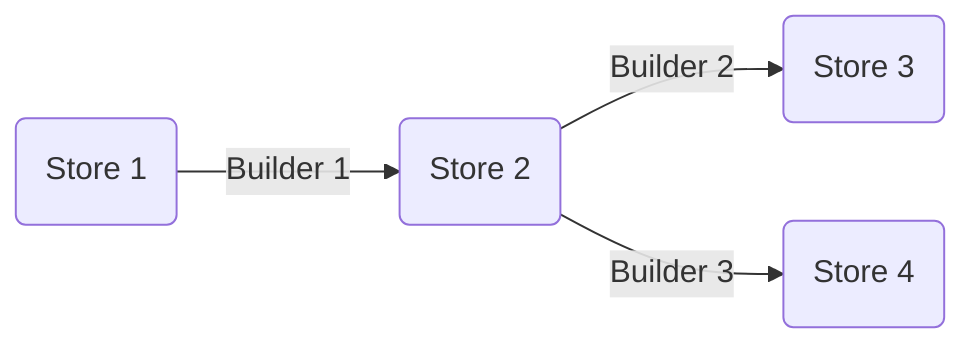

# 

[](https://materialsproject.github.io/maggma) [](https://github.com/materialsproject/maggma/actions?query=workflow%3Atesting) [](https://codecov.io/gh/materialsproject/maggma) []()

## What is Maggma

Maggma is a framework to build scientific data processing pipelines from data stored in
a variety of formats -- databases, Azure Blobs, files on disk, etc., all the way to a
REST API. The rest of this README contains a brief, high-level overview of what `maggma` can do.
For more, please refer to [the documentation](https://materialsproject.github.io/maggma).


## Installation

### From PyPI

Maggma is published on the [Python Package Index](https://pypi.org/project/maggma/).  The preferred tool for installing
packages from *PyPi* is **pip**.  This tool is provided with all modern
versions of Python.

Open your terminal and run the following command:

``` shell
pip install --upgrade maggma
```
### Direct from `git`

If you want to install the latest development version, but do not plan to
make any changes to it, you can install as follows:

``` shell
pip install git+https://github.com/materialsproject/maggma
```

### Local Clone

You can install Maggma directly from a clone of the [Git repository](https://github.com/materialsproject/maggma).  This can be done either by cloning the repo and installing from the local clone, or simply installing directly via **git**.

``` shell
git clone https://github.com//materialsproject/maggma
cd maggma
python setup.py install
```

## Basic Concepts

`maggma`'s core classes -- [`Store`](#store) and [`Builder`](#builder) -- provide building blocks for
modular data pipelines. Data resides in one or more `Store` and is processed by a
`Builder`. The results of the processing are saved in another `Store`, and so on:



### Store

A major challenge in building scalable data pipelines is dealing with all the different types of data sources out there. Maggma's `Store` class provides a consistent, unified interface for querying data from arbitrary data sources. It was originally built around MongoDB, so it's interface closely resembles `PyMongo` syntax. However, Maggma makes it possible to use that same syntax to query other types of databases, such as Amazon S3, GridFS, or files on disk, [and many others](https://materialsproject.github.io/maggma/getting_started/stores/#list-of-stores). Stores implement methods to `connect`, `query`, find `distinct` values, `groupby` fields, `update` documents, and `remove` documents.

The example below demonstrates inserting 4 documents (python `dicts`) into a `MongoStore` with `update`, then
accessing the data using `count`, `query`, and `distinct`.

```python
>>> turtles = [{"name": "Leonardo", "color": "blue", "tool": "sword"},
               {"name": "Donatello","color": "purple", "tool": "staff"},
               {"name": "Michelangelo", "color": "orange", "tool": "nunchuks"},
               {"name":"Raphael", "color": "red", "tool": "sai"}
            ]
>>> store = MongoStore(database="my_db_name",
                       collection_name="my_collection_name",
                       username="my_username",
                       password="my_password",
                       host="my_hostname",
                       port=27017,
                       key="name",
                    )
>>> with store:
        store.update(turtles)
>>> store.count()
4
>>> store.query_one({})
{'_id': ObjectId('66746d29a78e8431daa3463a'), 'name': 'Leonardo', 'color': 'blue', 'tool': 'sword'}
>>> store.distinct('color')
['purple', 'orange', 'blue', 'red']
```

### Builder

Builders represent a data processing step, analogous to an extract-transform-load (ETL) operation in a data
warehouse model. Much like `Store` provides a consistent interface for accessing data, the `Builder` classes
provide a consistent interface for transforming it. `Builder` transformation are each broken into 3 phases: `get_items`, `process_item`, and `update_targets`:

1. `get_items`: Retrieve items from the source Store(s) for processing by the next phase
2. `process_item`: Manipulate the input item and create an output document that is sent to the next phase for storage.
3. `update_target`: Add the processed item to the target Store(s).

Both `get_items` and `update_targets` can perform IO (input/output) to the data stores. `process_item` is expected to not perform any IO so that it can be parallelized by Maggma. Builders can be chained together into an array and then saved as a JSON file to be run on a production system.

## Origin and Maintainers

Maggma has been developed and is maintained by the [Materials Project](https://materialsproject.org/) team at Lawrence Berkeley National Laboratory and the [Materials Project Software Foundation](https://github.com/materialsproject/foundation).

Maggma is written in [Python](http://docs.python-guide.org/en/latest/) and supports Python 3.9+.
